# Erwartungen 1-mal-1

---

# Naiver Erklärungsversuch

- Ich gehe mit Bestimmtheit davon aus, dass
  - sich eine Person auf eine bestimmte Weise verhält.
  - ein konkretes Ziel erreicht wird.
  - ein ein Ziel in einer bestimmten Zeit erreicht wird.

---

# Psychologie

<v-click>✅</v-click> Eine Einstellung, welche sich auf mehr oder weniger klare Zielvorstellungen und künftig mögliche Ereignisse bezieht und aus der Wahrnehmung von Selektionen oder Umdeutungen erschlossen wird.

[Wikipedia](<https://de.wikipedia.org/wiki/Erwartung_(Psychologie)>)

# Soziologie

<v-click>💡</v-click>Zum einen beschreibt er die Annahme eines Handelnden darüber, was ein anderer oder mehrere andere tun würden (antizipatorische Erwartung), zum anderen auch das, was er oder andere billigerweise tun sollten (normative Erwartung).
Wird eine Erwartung enttäuscht, dann wird sie meist geändert, in einigen wenigen Fällen aber auch aufrechterhalten (Kontrafaktische Stabilität).

[Wikipedia](<https://de.wikipedia.org/wiki/Erwartung_(Soziologie)>)

---

# Antizipatorische Erwartung

```mermaid
sequenceDiagram
    Me->>Captain: Erwartung A ❓
    Captain->>Me: Erwartung B ❌
    Me->>Captain: Erwartung A' ❓
    Captain->Me: ...
    Captain->Me: Gemeinsame Erwartungshaltung 🥳
```

<!--
- Prozess gilt als motivierend
-->

---
layout: image-right
image: /erwartungen/islands.jpg
---

# Wie entsteht eine Erwartung?

- Wir bewerten erlebte Erfahrungen
- Wir vereinbaren etwas gemeinsam
- Wir treffen einseitig Annahmen

---
layout: image-left
image: /erwartungen/frustration.jpg
---

# Wieso weichen unsere Erwartungen voneinander ab?

<v-clicks>

- Bias (Vorurteile)
- Aneinander Vorbeireden
- Problemstellung nicht in aller Tiefe durchdrungen
- Angst vor Fragen
- Ablenkung (Social Media, E-Mails, ...)
- Ermüdung
- Resignation
- Trotz

</v-clicks>
