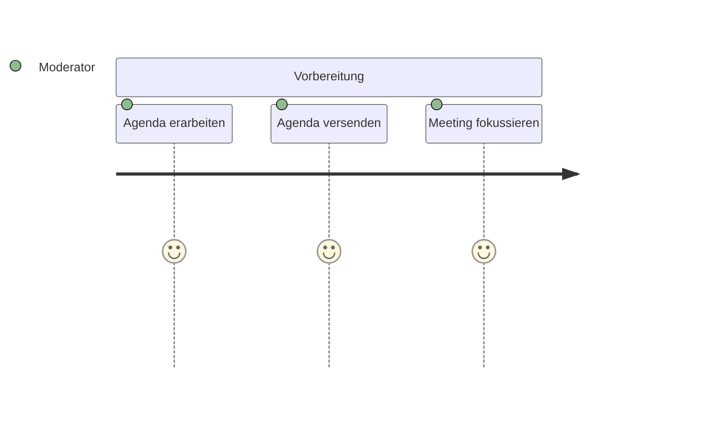
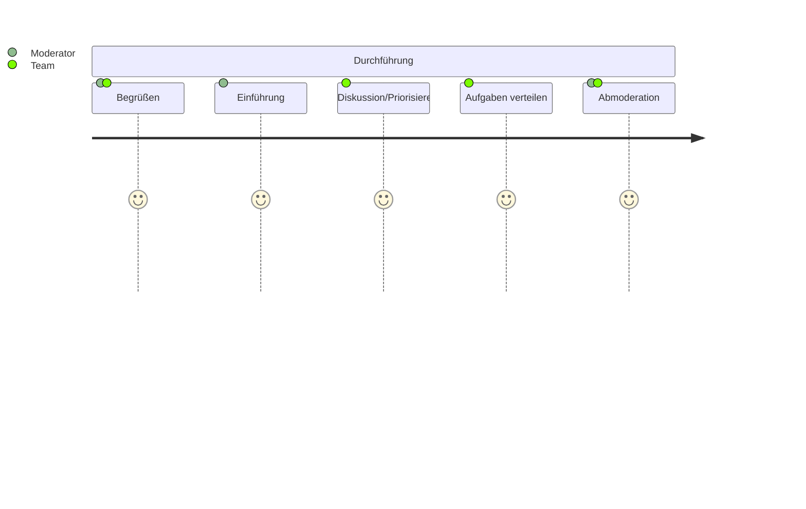
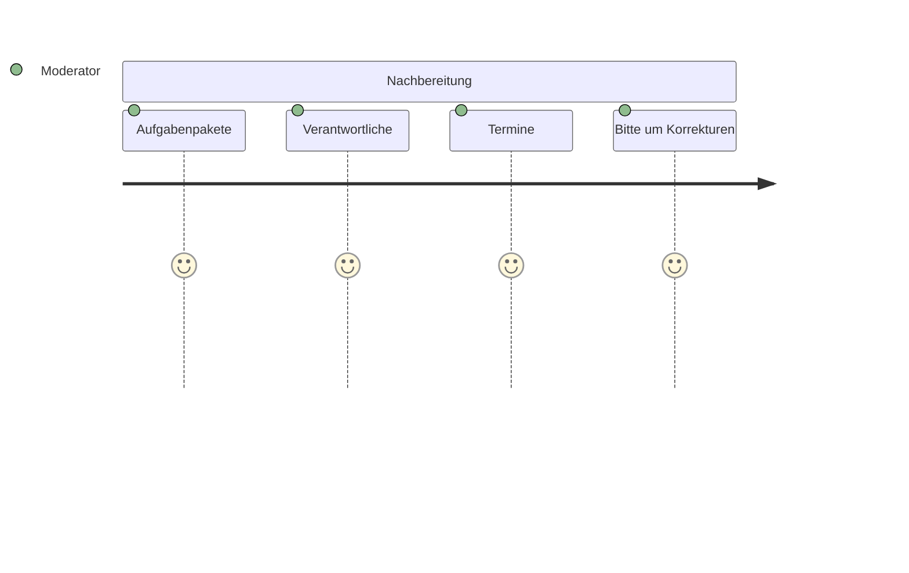

# Hacks

---

# Hacks

<Transform :scale="1.25">

- 🫵🏻 Deine Erwartung zählt
- 🤝 Meeting
- 💦 Gießkannenprinzip
- ➿ Feedback Loops
- 🧘🏻 Selbstoffenbarungsbotschaft

</Transform>

---
layout: image-left
image: /hacks/think.jpg
---

# Deine Erwartung zählt

<v-clicks>

- Definiere konkrete Erwartungen
- Baue <span v-mark.circle.yellow>antizipatorisch</span> eine gemeinsame Haltung auf.

</v-clicks>

---

# Meeting



---

# Meeting



---

# Meeting



---

# Bsp.: Meeting Vorbereitung

```markdown {*}{maxHeight:'400px'}
# 🔨 Entscheidung zu Space

- Wir haben uns damals für Space entschieden, weil wir den Pitch von JetBrains so verstanden hatten, dass in Space alle derzeitigen Produkte (vor allem YouTrack & TeamCity), die wir gut finden in einer Plattform zusammenfinden.
- Scheinbar hat sich die Mission von Space verändert, da inzwischen auf der Landing-Page wieder mehr auf die Integration mit anderen Produkten verwiesen wird, anstelle all dessen Funktionen selbst zu liefern.

# 🤔 Das war uns damals wichtig

- Development Flow: Möglichst wenig Kontext-Switches zwischen organisatorischen- und Entwicklungs-Tools
- Wissensmanagement: Die Fachlichkeit der Systeme muss dokumentiert werden können und gut gut durchsucht werden können.
- Kundenmanagement: Für verschiedene Kunden sollen abgegrenzte Bereiche geschaffen werden, zu denen und die jeweiligen Teams Zugang haben (Dies müssen wir manchmal vertraglich zusichern)
- Der Betrieb von eigenen Agents, damit wir in der Lage sind den Legacy VB6-Code zu bauen

# 🫢 Das haben wir damals außer Acht gelassen

- Wir keinen Durchstich beim Deployment gemacht.
  Damals war auch völlig unklar, wie wir unsere Services betreiben werden.
- Wir sind mit Windows-Services gestartet und inzwischen auf Docker umgestiegen.

# 🤯 Diese Fehler sind uns bei der Evaluation unterlaufen

- Wir haben keinen Durchstich gemacht: Sprint planen, Entwickeln, Reviewen, Automatisiert Testen & Deployen
- Bei uns hat sich der Glaube festgesetzt Space ist wie JetBrains TeamCity & YouTrack zusammen

# 💥 Probleme in der Bedienbarkeit

- Verlinkung zwischen Pull-Request und Job nur einseitig. Man kommt vom Job nicht wieder zurück in den Pull-Request
  Generell benötigt es viele Klicks, wenn man zwischen Issues und Code navigiert
- Mehrere Suchen mit unterschiedlichem Verhalten
  Globale Suche (STRG-SHIFT-F)
- Durchsucht auch Dokumente, aber es gibt keine Vorschau, was im Dokument gefunden wurde
  Dokumentensuche
- Gibt Vorschau, was im Dokument gefunden wurde
- Suche kann nicht mit Umlauten umgehen und liefert keine Ergebnisse mehr.
- Funktionsumfang entspricht nicht dem, was wir von GitHub & Co kennen
- Beispiel: Auto-Close von Issues, wen PR abgeschlossen wird (Gibt’s in Team-Paket nicht. Dafür muss der Organisations-Plan gekauft werden)

# 🧱 Das behindert uns

- Bei der CI/CD ist das Ökosystem noch jung.
- Vieles was in GitHub mit Actions mit wenig Aufwand konfiguriert ist, muss in Space selbst programmiert werden (Bsp.: Tagging von Docker-Images).
- Die Dauer der Ausführung automatischer Jobs variiert stark.
- Wir beobachten Schwankungen von 5 - 10 Minuten.
- Technisch sind einige Dinge in Space derzeit nicht möglich, die die Job-Zeiten verlängern. Bsp.: Cachen von Docker-Layers
- Logs werden im CI abgeschnitten, sodass man sich fast immer das Log herunterladen muss.
- Deployment über Ansible konnten wir nicht in einem vertretbaren Aufwand mit Space umsetzen.

# ⛈️ Weitere Technische Probleme | Automation

- Es können nur Jobs und steps konfiguriert werden
  Jobs laufen immer! parallel ab
- Es gibt keine dependencies
  Steps können nicht manuell getriggert werden
  Jobs nur mit Umwegen
- Es können keine Informationen zwischen Jobs geteilt werden- PowerShell kann nicht genutzt werden
  Ein repository ist immer read-only, wird im detached head state geklont
- Es kann ein SSH key zum schreiben hinterlegt werden (Use Case: Tagging, Fast-Forward-Merges)
- CI-spezifische Variablen sind nicht gesetzt
- Kotlin!-Runner kann nicht genügend konfiguriert werden max Ausführungsdauer 2h
- Pipelines dauern ewig, weil immer irgendwas rumkonfiguriert wird - Unvorhergesehene Downloads seitens des Runners (Gradle)
  Logs nur als Download (ja mein Downloads Ordner ist voller logs)

# Dokumente

komisches Konzept
ein wiki hätte mehr gebracht
Markdown Syntax ohne Checkboxen
Notifications

Es brauchte einen Proxy um die Nachrichten an Slack zu senden. – Umständlich
Notifications zu Dokumenten funktionieren gar nicht. – Lässt sich nicht alles automatisieren
Wir wollten hier nur benachrichtigt werden, wenn es was Neues in den Dokumenten gibt, damit man einen Trigger zum nachlesen hat.
Undurchsichtiges Lizensierungskonzept

Essenzielle Features erst in größeren Paketen "versprochen"
wenn die genauso rudimentär umgesetzt werden: gute Nacht
YouTrack

Migrationstool von YouTrack zu Space unbrauchbar

# 👍🏻 Das klappt gut

Die Code-Reviews funktionieren, wie man das von allen anderen Plattformen kennt.

# 🔮 Überlegungen wie es weiter geht

- Wir wünschen uns eine Plattform mit ausgereiften Ökosystem, dass Build und Deployment unserer Services erleichtert.
  Community, mit der man sich bei Problemen austauschen kann.
  Anforderungsmanagement und Wiki
- Wir haben im Team die Anforderung nach Durchsuchbarkeit bis weit in die Vergangenheit.
  Nur nutzen wir das momentan nicht,
- Wir müssen uns hier noch klar werden, was genau wir auswerten wollen, was wir nicht im Code in Form von Tests (Specs) hinterlegen können.
- Wir werten momentan auch nichts aus, was unsere Anforderungen angeht, hinsichtlich Velocity usw.
  Im Team liebäugeln wir derzeit schon mit GitHub. Wir alle kennen es aus der Open Source Entwicklung, Alex hat berichtet, das hinsichtlich Docker dort mehr geht.
- Wir Devs fühlen uns mit der GitHub-UI/UX wohl
  Eventuell sollten wir uns auch fragen, ob wir Issues für die Entwickler und andere Dokumente, die während der Entwicklung entstehen woanders platzieren.
  Für andere Kunden nutzen wir bspw. OneDrive
```

---
layout: image-right
image: /hacks/watering-can.jpg
---

# Gießkannenprinzip

- 🚩 zu Viel
- 🚩 zu Ungenau
- 🚩 zu Einseitig

---
layout: image-left
image: /hacks/selbstoffenbarung.jpg
---

# Selbstoffenbarung

Habe den Mut dir ab und an Raum zu verschaffen.

1. Beobachtung schildern
1. Deine Gefühle zum Ausdruck bringen
1. Dein Bedürfnis äußern
1. Deiner Bitte Ausdruck verleihen
